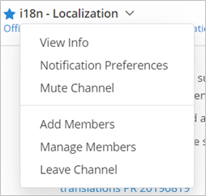
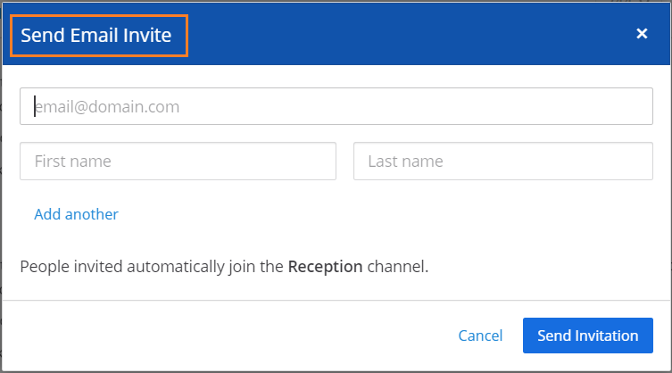

# User Interface Text Guidelines

## UX Writing Principles

Following the Writing Guidelines below will ensure communications to our users feel like they are coming from the same voice.

**Concise**

Use short words and sentences. Avoid unnecessary fluff.

**Clear**

Always write for clarity and simplicity. Err on the side of simple language that can be understood by novice users and avoid vague terms.

**Consistent**

Be consistent with terminology across the product. Although we may have different terms for the same things internally, always use the same language to describe the same thing within the product.

## User interface text guidelines 

These guidelines cover two types of UI text:
- Messages triggered because something happened
- Static text on the user interface

### General principles for UI (in-product) text

- Keep in mind that your users are from all over the world. 
- Use the present tense to describe a current state or condition, and the future tense to state something that is very definitely going to happen.
- Use the active voice, except for these cases:
  - If you’ll end up blaming the user. For example, don’t say **You entered an incorrect password**. Instead, say **The password is incorrect**.
  - If you’re describing what just happened. For example, it’s okay to say **Your incoming webhook is set up**.
  - If the subject (the doer of an action) is the Mattermost application itself. For example, it’s okay to say **The image is deleted** instead of **The server deleted the image**.
- If you’re asking the user to do or not do something, use imperatives (command phrases). For example, say **Do not change the Hostname** instead of saying **It is not recommended to change the Hostname**. Better still, explain what could go wrong if they do or don’t do something. For example, say **Do not change the Hostname because if you do so <this bad thing will happen>**.

### Guidelines for System Messages

Don’t blame the user. Inform them about what happened, explain why it happened, and suggest a way forward. Try to use complete sentences in your messages. A sentence phrase (an incomplete sentence) might sound okay in English but could present internationalization challenges.

If a System Message contains variables (tokens):
- Do not use verbs or adjectives as variables.
- Do not create plurals of variables by adding an s.
- If the variable is a noun, use a qualifier after the variable. For example, say **The {channel_name} channel was created** instead of saying **The {channel_name} was created**.

System Messages can be of the following types: **notification**, **confirmation**, **warning**, and **error**. The following sections contain guidelines that are specific to each of these types.

### Notification messages

A notification message is for informing somebody about something that happened. Such messages do not need any user input, and do not prevent a user from continuing to use Mattermost.

- Use either a complete sentence or a sentence phrase.
- If using a complete sentence, end it with a period.
- Examples:
  - **Member added to channel.**
  - **The plugin was installed.**

### Confirmation messages

A confirmation message is for asking somebody to confirm whether the immediately preceding command should be proceeded with. The user cannot use Mattermost until a confirmation is given or denied.

- Use complete sentences.
- Include a question that has a Yes/No answer.
- Examples:
  - **Are you sure you want to delete this channel?**
  - **A plugin with this ID already exists. Would you like to overwrite it?**

### Warning messages

A warning message is for alerting somebody about something that might go wrong. The user can continue using Mattermost unless the warning message needs an explicit user input.

- Use complete sentences.
- Explain what has happened or can happen, and what can go wrong as a consequence.
- Examples:
  - **The Enterprise license expires in 2 days. If you do not renew it, some features will be disabled on licence expiry.**
  - **If you claim this AD/LDAP account, you will no longer be able to log in with your email.**

### Error messages

An error message is for telling somebody that something went wrong. Errors prevent a user from doing a task or accessing a feature till the error is resolved.

- Use complete sentences.
- If what went wrong isn’t obvious, explain in one sentence.
- If a solution or workaround isn’t obvious, suggest one.
- Examples:
  - **Messages must have fewer than 120 characters.**
  - **A connection to the marketplace server could not be established. Check your settings on the [System Console](<hyperlink>)**. 
  
## Button labels and links

Button labels should always use action words and describe the action as concisely as possible. They should be limited to four words or less. Examples: “Log In”, “Send Invitation”.

## Navigation labels

Navigation labels should be as short as possible and support the user in finding their way.

### Input labels

Input labels should be as short and concise as possible and describe the input field.

### Capitalization

**Titles** 

Titles should use Sentence case. Exceptions would be when proper nouns are being used.

**Button labels, input labels and navigation labels** 

These labels should use Sentence case. Exceptions would be when proper nouns are being used.

### Punctuation

**Titles**

Titles should omit periods unless the headline is more than one sentence.

**Paragraphs**

Paragraphs should always use proper punctuation.

**Bullets**

Bullets should omit periods unless the bullet text is more than one sentence.

**Button labels**

Button labels should always omit periods or punctuation.

## Guidelines for UI elements

Use this table when writing the text for UI elements such as windows, dialog boxes, labels, and prompts.

<table>
<colgroup>
<col style="width: 10%" />
<col style="width: 30%" />
<col style="width: 10%" />
<col style="width: 25%" />
<col style="width: 25%" />
</colgroup>
<thead>
<tr class="header">
<th>Element</th>
<th>Image</th>
<th>Capitalization</th>
<th>Phrasing</th>
<th>Examples</th>
</tr>
</thead>
<tbody>
<tr class="odd">
<td>Menu</td>
<td></td>
<td>Headline style</td>
<td><ul>
<li>Noun, noun phrase, or verb</li>
<li>No punctuation</li>
<li>Not more than three words</li>
<li>Action after clicking is obvious, without needing someone to click to discover</li>
</ul></td>
<td><ul>
<li><em>Members</em></li>
<li><em>Account Preferences</em></li>
<li><em>Log Out</em></li>
</ul></td>
</tr>
<tr class="even">
<td>Tooltip</td>
<td></td>
<td>Sentence style</td>
<td><ul>
<li>Sentence fragment or sentence</li>
<li>No punctuation</li>
<li>Include articles (<em>a</em>, <em>an</em>, <em>the</em>)</li>
<li>Keep it short</li>
</ul></td>
<td><ul>
<li><em>Start a Zoom meeting</em></li>
<li><em>Flag for following up</em></li>
<li><em>Remove from this list</em></li>
</ul></td>
</tr>
<tr class="odd">
<td>In-field text</td>
<td></td>
<td>Sentence style</td>
<td><ul>
<li>Sentence fragment, sentence, or word that's an example of a valid entry</li>
<li>No punctuation</li>
<li>Include articles (<em>a</em>, <em>an</em>, <em>the</em>)</li>
</ul></td>
<td><ul>
<li><em>Add a comment</em></li>
<li><em>Search</em></li>
</ul></td>
</tr>
<tr class="even">
<td>Action button</td>
<td></td>
<td>Headline style</td>
<td><ul>
<li>Verb or verb phrase</li>
<li>No longer than 3 words</li>
<li>No articles (<em>a</em>, <em>an</em>, <em>the</em>)</li>
<li>Exceptions: <em>OK</em>, <em>Yes</em>, <em>No</em></li>
</ul></td>
<td><ul>
<li><em>Add Comment</em></li>
<li><em>Edit</em></li>
</ul></td>
</tr>
<tr class="odd">
<td>Label before a UI element</td>
<td></td>
<td>Sentence style</td>
<td><ul>
<li>Noun, verb, or sentence fragment that's the title of the UI element</li>
<li>End with a colon where it precedes another UI element such as a radio button or check box</li>
<li>Include articles (<em>a</em>, <em>an</em>, <em>the</em>)</li>
</ul></td>
<td><ul>
<li><em>Sign in with:</em></li>
<li><em>Other words, separated by commas:</em></li>
</ul></td>
</tr>
<tr class="even">
<td>Label after a UI element</td>
<td></td>
<td>Sentence style</td>
<td><ul>
<li>Noun, verb, or sentence fragment</li>
<li>No punctuation</li>
<li>Brief (lengthier explanations belong to help text)</li>
</ul></td>
<td><ul>
<li><em>Channels grouped by type</em></li>
<li><em>Alphabetically</em></li>
</ul></td>
</tr>
<tr class="odd">
<td>Help text</td>
<td></td>
<td>Sentence style</td>
<td>Complete sentences, with punctuation</td>
<td><ul>
<li><em>You can add 20 more people.</em></li>
<li><em>People are invited automatically to join the channel.</em></li>
</ul></td>
</tr>
<tr class="even">
<td>Title</td>
<td></td>
<td>Headline style</td>
<td><ul>
<li>Sentence fragment or sentence</li>
<li>No punctuation</li>
</ul></td>
<td><ul>
<li><em>Notification Preferences for Channel</em></li>
<li><em>Contributors</em></li>
</ul></td>
</tr>
</tbody>
</table>

.. [*] For headline style, capitalize all words except those with 3 letters or fewer, articles (*a*, *an*, *the*), prepositions (*on*, *to*, *in*, *from*, *of*), and coordinating conjunctions (*and*, *but*, *or*, *for*). Despite these exceptions, always capitalize the first and last word. For sentence style, capitalize only the first word.

